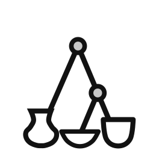

#  CeraMatch
Visual shape-matching and classification of ceramics

Created on 18. 5. 2019

<details>
<summary>Table of Contents</summary>

1. [About CeraMatch](#about)
2. [Installation](#installation)
3. [Video Guide](#videoguide)
4. [Sample Data](#sampledata)
5. [Generating Datasets](#generating)
6. [Contact](#contact)
7. [Acknowledgements](#acknowledgements)
8. [License](#license)

</details>

## About CeraMatch <a name="about"></a>

A graphical user interface to a [Deposit](https://github.com/demjanp/deposit) database of digitized ceramic fragments created using the [Laser Aided Profiler](https://www.laseraidedprofiler.com/) control application which implements automated ceramic shape matching and clustering as described in [Demján et al. 2022](https://doi.org/10.1080/00934690.2022.2128549).

It has three basic functions: calculate (dis)similarity between samples; perform automatic clustering; and, allow users to rearrange clusters freely until they represent a valid classification. Furthermore, CeraMatch quantifies the degree of similarity of each fragment to a certain class, allowing for a probabilistic approach to classification, in which each vessel profile has quantifiable probabilities of belonging to particular classes or sub-classes. The application uses a hierarchical cluster analysis algorithm to assign each fragment into a cluster of similar specimens, a prerequisite for classification.

For an in-depth description of the concepts behind CeraMatch see:

DEMJÁN, P. - PAVÚK, P. - ROOSEVELT, CH. H. 2022: Laser-Aided Profile Measurement and Cluster Analysis of Ceramic Shapes. Journal of Field Archaeology 47 (8). https://doi.org/10.1080/00934690.2022.2128549

## Installation <a name="installation"></a>

For a Windows installer see:

https://github.com/demjanp/ceramatch/releases/latest

To install the latest version of Ceramatch as a Python module use:
```
pip install ceramatch
```

To start the GUI execute:

[bin\start_cm.py](bin\start_cm.py)

## Video Guide: <a name="videoguide"></a>
[](https://youtu.be/2TPSN40nX7k)

## Sample Data: <a name="sampledata"></a>
Demján, P., Pavúk, P., Kaner, T., Bobik, J., & Roosevelt, C. H. (2021, October 15). Sample Data - Middle- to Late Bronze Age pottery from Kaymakçı. https://doi.org/10.17605/OSF.IO/UX8VD 

## Generating Datasets: <a name="generating"></a>
You can create digital ceramics drawings usable in CeraMatch using the [Laser Aided Profiler Control Application](https://www.laseraidedprofiler.com/support/) by digitizing pottery fragments directly using the LAP device, or by digitizing drawings in PDF or raster image format (see this [video guide](https://youtu.be/OeevHiLsQTw)).

## Contact: <a name="contact"></a>
Peter Demján (peter.demjan@gmail.com)

Institute of Archaeology of the Czech Academy of Sciences, Prague, v.v.i.

## Acknowledgements <a name="acknowledgements"></a>

Development of this software was supported by OP RDE, MEYS, under the project "Ultra-trace isotope research in social and environmental studies using accelerator mass spectrometry", Reg. No. CZ.02.1.01/0.0/0.0/16_019/0000728.

This software uses the following open source packages:
* [cryptography](https://github.com/pyca/cryptography)
* [Deposit GUI](https://github.com/demjanp/deposit_gui)
* [Deposit](https://github.com/demjanp/deposit)
* [Graphviz](https://www.graphviz.org/)
* [lap_data](https://github.com/demjanp/lap_data)
* [natsort](https://github.com/SethMMorton/natsort)
* [NetworKit](https://networkit.github.io/)
* [NetworkX](https://networkx.org/)
* [NumPy](https://www.numpy.org/)
* [OpenCV on Wheels](https://github.com/opencv/opencv-python)
* [OpenCV](https://opencv.org/)
* [openpyxl](https://openpyxl.readthedocs.io/)
* [Pillow](https://python-pillow.org/)
* [Psycopg](https://psycopg.org/)
* [PyGraphviz](http://pygraphviz.github.io/)
* [PyShp](https://github.com/GeospatialPython/pyshp)
* [PySide2](https://www.pyside.org/)
* [Qt](https://www.qt.io)
* [scikit-image](https://scikit-image.org/)
* [scikit-learn](http://scikit-learn.org/)
* [SciPy](https://scipy.org/)
* [Shapely](https://github.com/shapely/shapely)
* [svgelements](https://github.com/meerk40t/svgelements)
* [Unidecode](https://github.com/avian2/unidecode)
* [validators](https://github.com/kvesteri/validators)

## License <a name="license"></a>

This code is licensed under the [GNU GENERAL PUBLIC LICENSE](https://www.gnu.org/licenses/gpl-3.0.en.html) - see the [LICENSE](LICENSE) file for details
